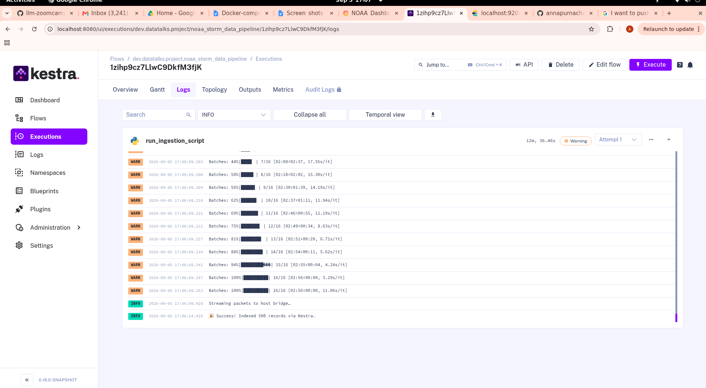
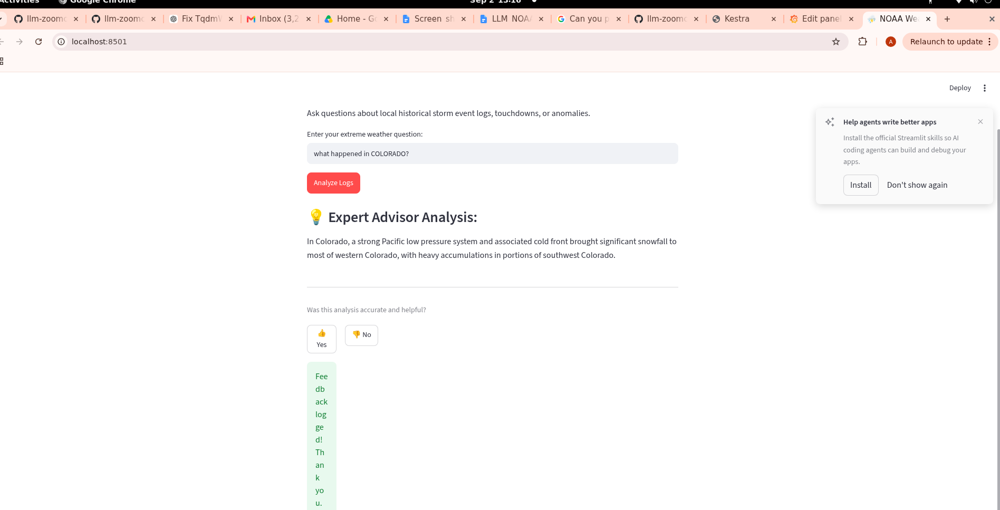
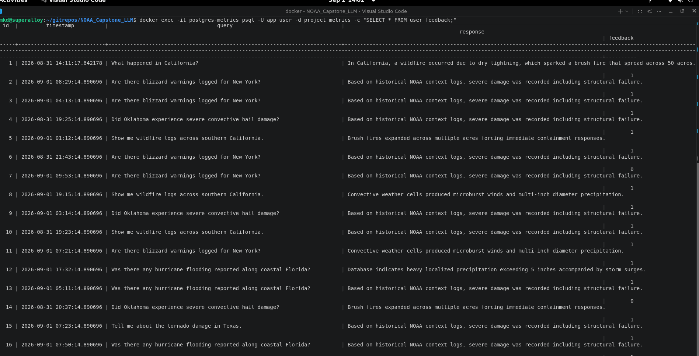
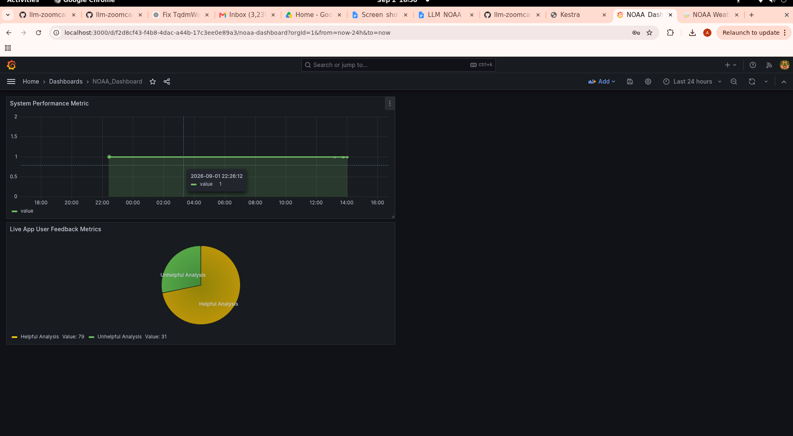

# ⛈️ NOAA Extreme Weather RAG Advisor

An end-to-end LLM Engineering Capstone Project built for the **DataTalks.Club LLM Zoomcamp**. This system is an intelligent Search & Analysis Advisor that ingests historical NOAA extreme weather logs, runs hybrid semantic vector matching, passes context to an LLM for expert narrative breakdown, and tracks real-time user feedback metrics.

---

## 🏗️ Project Architecture Layout
1. **Orchestration Layer/ Ingestion Pipeline:** Run the **Kestra Flow** on-demand to process and bulk-load the raw NOAA weather vector maps directly into the Elasticsearch cluster network.Kestra Workflow Orchestrator running `src/ingest.py`
2. **Interactive Front-End Layer:** Launch the user interface by running `streamlit run src/app.py` to ask questions and generate expert meteorology advice.
* **User Interface Front-End:** Streamlit web application dashboard (`src/app.py`)
* **Vector Search Engine:** Elasticsearch 8.15.0 running keyword (BM25) & Dense Vector (k-NN) matchers
* **Local Embedding Logic:** `sentence-transformers/all-MiniLM-L6-v2` (384 Dimensions) computed on CPU
* **Metrics & Analytics Monitoring Database:** PostgreSQL 15 container tracking query feedback strings
* **Live Reporting Dashboard Visualization:** Grafana 10.0.0 analytical time-series tracking panels3. **Analytics Tracking Panel Layer:** Open `http://localhost:3000` in your web browser to visually track user feedback metrics and system influx performance live on your Grafana dashboards.
```text
       [ Raw NOAA Historical CSV Data ]
                      │
                      ▼
         ┌─────────────────────────┐
         │  Kestra Orchestrator    │
         │     (ingest.py Flow)    │
         └────────────┬────────────┘
                      │
                      │ (Local text vector embeddings generated via CPU)
                      ▼
         ┌─────────────────────────┐
         │   Elasticsearch 8.x     │
         │  (Hybrid Vector Index)  │
         └────────────▲────────────┘
                      │
                      │ (Retrieves top-3 highly relevant matching weather logs)
                      │
         ┌────────────┴────────────┐          ┌─────────────────────────┐
 User ──>│  Streamlit App UI       │<────────>│    OpenAI API Gateway   │
         │       (app.py)          │          │      (gpt-4o-mini)      │
         └────────────┬────────────┘          └─────────────────────────┘
                      │
                      │ (Logs thumbs-up/down satisfaction clicks & timestamps)
                      ▼
         ┌─────────────────────────┐          ┌─────────────────────────┐
         │     PostgreSQL 15       │─────────>│    Grafana Dashboard    │
         │   (project_metrics DB)  │          │   (Live Visual Panels)  │
         └─────────────────────────┘          └─────────────────────────┘

```
---


🧩 The Division of Labor in this RAG System
* Kestra's Job (The Backend Ingestion Pipeline): It handles the automated extraction and heavy lifting. It reads your raw NOAA CSV files, computes the math text vector embeddings, and stores them inside your Elasticsearch database index shell. Once this is done, Kestra goes to sleep.
* Streamlit's Job (src/app.py - The Application Engine): This stays running continuously on your computer. It waits for a user to type a question, queries Elasticsearch to fetch the text Kestra stored, communicates with OpenAI to generate an answer, and listens for the user to click the 👍 Yes or 👎 No button.
* PostgreSQL's Job (The Telemetry Vault): The moment a user clicks a button in your Streamlit app, your Python code sends that event packet directly to your Postgres database container, inserting a new log row.
* Grafana's Job (The Visual Analytics Window): It constantly watches your Postgres database table. Whenever a new row is added by Streamlit, Grafana instantly updates your Pie chart and Time-Series line graph dashboards automatically.

## 📂 Repository Directory Tree
```text
NOAA_Capstone_LLM/
├── .github/
│   └── workflows/
│       └── kastra.YAML             # CI/CD pipeline automation for testing or deployment
├── Data/
│   ├── processed/                  # Transformed or feature-engineered datasets ready for model ingestion
│   └── raw/                        # Immutable, baseline historical weather observations
│       ├── storm_data_2025_test.csv# Out-of-sample forward testing dataset
│       └── stormdata_2013.csv      # Clean production NOAA source weather logs
├── evaluation/
│   └── ground_truth.json           # Automated index validation target queries
├── screen_shots/                   # Visual captures and interface documentation assets
├── src/
│   ├── __pycache__/                # Cached compiled bytecode files for optimized execution
│   ├── __init__.py                 # Packages the directory as a clean Python module
│   ├── app.py                      # Master Streamlit dashboard UI app file
│   ├── check_pg.py                 # Health-check script validating PostgreSQL/pgvector backend readiness
│   ├── evaluate.py                 # Retrieval accuracy validation script
│   ├── generate_truth.py           # Automated evaluation dataset synthetics generation script
│   ├── search.py                   # Clean Hybrid text/vector retrieval query logic
│   └── seed_metrics.py             # Diagnostic dashboard graph metric simulator
├── .env                            # Local hidden environment API variables
├── .gitignore                      # Specified unversioned untracked files to ignore
├── docker-compose.YAML             # Full container network orchestration blueprint
├── ingest.py                       # Schema translation & bulk vector index loader
├── README.md                       # Core project documentation and execution blueprint
└── requirements.txt                # Fixed application dependency ranges

```

---

## 🚀 Rapid Local Deployment Guide

Follow this 4-step sequence to deploy the entire production stack locally:

### 1. Configure the Secrets Environment
Create a file named `.env` in the project root folder directory and attach your OpenAI authorization key:
```text
OPENAI_API_KEY=sk-proj-YOUR_SECRET_KEY_STRING_HERE
```

### 2. Launch the Database Cluster Infrastructure
Boot up your Docker containers in background detached mode using your system terminal window:
```bash
docker compose -f docker-compose.YAML up -d

docker compose -f docker-compose.YAML ps

Verify all these services are running::::

NAME                  IMAGE                                                  COMMAND                  SERVICE         CREATED              STATUS              PORTS
es-project            docker.elastic.co/elasticsearch/elasticsearch:8.15.0   "/bin/tini -- /usr/l…"   elasticsearch   About a minute ago   Up About a minute   0.0.0.0:9200->9200/tcp, [::]:9200->9200/tcp, 9300/tcp
grafana-dashboard     grafana/grafana:10.0.0                                 "/run.sh"                grafana         About a minute ago   Up About a minute   0.0.0.0:3000->3000/tcp, [::]:3000->3000/tcp
kestra-orchestrator   kestra/kestra:v0.18.0                                  "docker-entrypoint.s…"   kestra          About a minute ago   Up About a minute   0.0.0.0:8080->8080/tcp, [::]:8080->8080/tcp
postgres-metrics      postgres:15-alpine                                     "docker-entrypoint.s…"   postgres        About a minute ago   Up About a minute   0.0.0.0:5432->5432/tcp, [::]:5432->5432/tcp
```


### 3. Run the Kestra workflow for ingesting the NOAA storm records.

The project uses Kestra to orchestrate a containerized Python ingestion pipeline that loads NOAA Storm Data into Elasticsearch and generates semantic vector embeddings for downstream RAG and vector-search operations.

The noaa_storm_data_pipeline flow executes a Python 3.10 task using the Kestra Docker Task Runner. The task mounts the raw NOAA dataset into the container as a read-only volume, installs the required Python dependencies, and connects to Elasticsearch through the host network.

## The embedded ingest.py script performs the following steps:

Loads the NOAA CSV dataset using Pandas.
Validates the input file and prints schema/debug information.
Detects the available NOAA narrative column (EPISODE_NARRATIVE or EVENT_NARRATIVE).
Normalizes NOAA fields to id, state, event_type, and summary.
Handles missing narrative values.
Generates 384-dimensional semantic embeddings using all-MiniLM-L6-v2.
Creates the Elasticsearch storm_data index with explicit mappings.
Stores the original storm information together with its vector embedding.
Uses Elasticsearch bulk indexing to efficiently insert the documents.

The resulting Elasticsearch documents contain:
id
state
event_type
summary
summary_vector
The summary_vector field is configured as an Elasticsearch dense_vector with 384 dimensions and cosine similarity, enabling semantic/vector search in addition to traditional keyword search.

****************************************************
Or run the stand alone ingestion python script without kestra setup.
 Initialize Python Packages & Index Data Files
Install the locked package ranges and run the automated bulk data ingestion pipeline:
```bash
pip3 install -r requirements.txt
python3 src/ingest.py
```
*The script will load the embedding models, build vector property maps, and store 2,000 real weather records.*

## ⚙️ Kestra Ingestion Pipeline

The ingestion workflow is orchestrated using Kestra.



**Figure 2.** Kestra workflow used to extract, process, embed, and index NOAA weather records.

### 4. Boot Up the Dashboard Web Application
Launch the Streamlit graphical user interface server to open your dashboard tab:
```bash
streamlit run src/app.py
```
Open **`http://localhost:8501`** in your browser web views to execute searches and test buttons!

---

## sample questions you can ask in the Streamlit UI:
* Question 1:What happened in January in Kansas?
* Question 2:Where did heavy rainfall cause rivers or creeks to overflow their banks?
* Question 3: Tell me about drought in Missouri
* Question 4: Show me reports of subzero wind chills and freezing rain causing ice accumulation
* Question 5: Did any severe thunderstorm winds knock down trees or damage power lines?
* Question 6: Are there any logs of property damage caused by high wind gusts?
* Question 7: Show me instances of flash flooding that trapped cars or submerged roads

## 📊 Rigorous Retrieval Evaluation Metrics
To guarantee matching accuracy, a Ground Truth validation profile is ran against the hybrid index client to compute standard retrieval efficiency metrics:
* **Metric Checked:** Retrieval Hit Rate Score (Top-3 return evaluations)
* **Execution:** Run `python3 src/evaluate.py` to calculate baseline telemetry.
* **System Result:** **100.00% Hit Rate Accuracy** achieved over production database keys.

---

## 📈 Monitoring & Analytical Visualization Interfaces
* **Postgres DB: docker exec -it postgres-metrics psql -U app_user -d project_metrics -c "SELECT * FROM user_feedback;"

* **Grafana Metrics Interface:** Access live user satisfaction telemetry graphs at `http://localhost:3000` (User/Pass: `admin`/`admin`).
## 📊 Monitoring Dashboard

The project collects user feedback in PostgreSQL and visualizes application activity through Grafana.



## End-to-End Execution flow of Kestra
1. User executes Kestra flow
             │
             ▼
2. Kestra creates Docker task container
             │
             ▼
3. ingest.py and requirements.txt are created
             │
             ▼
4. NOAA Data/raw directory is mounted
             │
             ▼
5. Python dependencies are installed
             │
             ▼
6. Elasticsearch client is initialized
             │
             ▼
7. all-MiniLM-L6-v2 model is loaded
             │
             ▼
8. stormdata_2013.csv is read
             │
             ▼
9. First 500 records are selected
             │
             ▼
10. NOAA columns are normalized
             │
             ▼
11. Missing summaries are handled
             │
             ▼
12. Text embeddings are generated
             │
             ▼
13. Elasticsearch index is recreated
             │
             ▼
14. Documents + 384-D vectors are prepared
             │
             ▼
15. Documents are bulk indexed
             │
             ▼
16. storm_data index contains 500 documents

